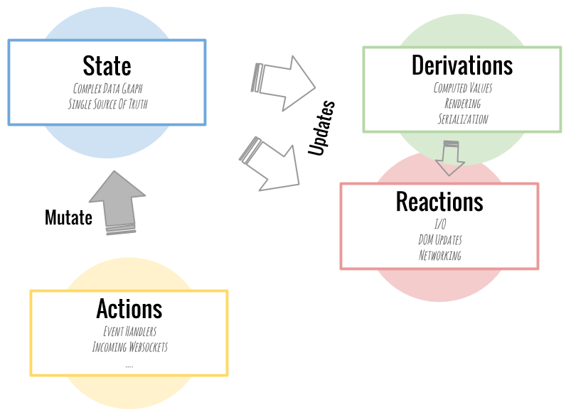

https://mobx.js.org/getting-started - introduction to MobX and React

Для работы с MobX нужно установить:
- "mobx",
- "mobx-react-lite" - lite, тк в пакет не входят декораторы. если мы используем классовые компоненты, то устанавить нужно ``mobx-react`` вместо этой либы

MobX простой и масштабируемый стэйт м менеджемент.

Основная идея:


1. State. Существует стэйкт в котором могут храниться объекты, массивы и тд.
2. Вычисляемые поля (derivations): По сути, это любое значение, которое может быть вычислено автоматически из состояния вашего приложения. Эти производные, или вычисляемые значения, могут варьироваться от простых значений и до сложных. (К примеру список тасок со стутесом завершены, кол-во выполннных тасок и тд)
3. Reactions (сайд эффекты) (очень походи на derivations). Главное отличие в том, что эти функции не производят значения. Вместо этого они запускаются автоматически для выполнения некоторой задачи. Обычно это связано с вводом/выводом. Они следят за тем, чтобы DOM обновлялся или чтобы сетевые запросы выполнялись автоматически в нужное время.
4. Actions.  Это все те действия, которые изменяют стэйт. При выполнении како-то действия, MobX обновляет и derivations и Reactions (если они зависят от значения, которое было изменено). К примеру мы изменили статус какой-то таски на завершено, значит список завершенных тасок будет обновлен и кол-во завершенных тасок будет тоже обновлен

Пример простого стейта:
```ts
import {action, computed, makeObservable, makeAutoObservable, observable} from "mobx";

class TodoStore {
    todos: Todo[] = []

    constructor() {
        makeAutoObservable(this, {}, { autoBind: true })
        
        // makeObservable(this, {
        //     todos: observable,
        //     addTodo: action.bound,
        //     updateTodo: action.bound,
        //     deleteTodo: action.bound,
        //     countTodos: computed //(computed.struct),
        // });
        // all availible annotations (observable, action, computed, etc.): https://mobx.js.org/observable-state.html#available-annotations
    }

    addTodo(name: string) {
        const newTodo = {id: new Date().getTime(), name, isCompleted: false};

        this.todos.push(newTodo)
    }

    updateTodo(updatedTodo: Todo) {
        this.todos = this.todos.map(item => item.id === updatedTodo.id ? updatedTodo : item)
        
        // если нам нужно обновить только имя (к примеру), то не нужно делать копию объекта, а просто todo.name = newName 
    }

    deleteTodo(id: number) {
        this.todos = this.todos.filter(item => item.id !== id)
    }

    get countTodos() {
        return this.todos.length
    }
}

export const todoStore = new TodoStore()
```
В конструкторе мы можем использовать либо ``makeAutoObservable`` или ``makeObservable``. Исли мы используем ``makeObservable``, то мы вручную
должны указать какой поле является ``observable``, какая функция будет вычисляемой (``computed``), а какая функция будет ``action``. 
При использовании ``makeAutoObservable`` всё присвоение происходит автоматически 

Если компонента реакта использует данные стейта, то необходимо обернуть ``observer``. можно сказать, что ``observer === React.memo``
```tsx
import {observer} from "mobx-react-lite"

const TodoList = () => {
    const {todos = [], addTodo, updateTodo, deleteTodo, countTodos} = todoStore;

    const handleButtonClick = () => {
        const name = window.prompt("Todo title");
        addTodo(name ?? 'unknown')
    }

    return <>
        <span>Total items: {countTodos}</span>
        <Card style={{marginTop: '24px', padding: '8px'}}>
            {!countTodos && <Card.Body>List of todos is empty.</Card.Body>}
            {Boolean(countTodos) &&
                <Card.Text>
                    <ul>
                        {todos?.map(item => <li key={item.id}><Todo item={item} deleteItem={deleteTodo} updateItem={updateTodo}/>
                        </li>)}
                    </ul>
                </Card.Text>
            }
        </Card>
        <Button style={{marginTop: '10px'}} onClick={handleButtonClick}>create todo</Button>
    </>
}

export default observer(TodoList)
```


